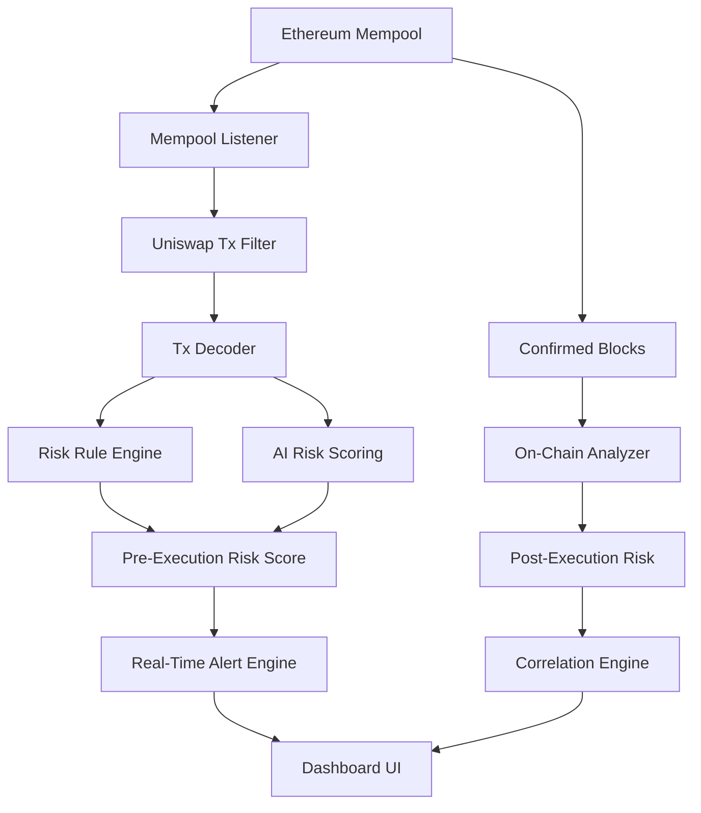

<div align="center">

# MEVGuard

### Real-Time DeFi Attack Early Warning System for Uniswap

**Detecting DeFi attacks *before* they are executed — using mempool intelligence and on-chain correlation**

[](https://react.dev/)
[](https://nodejs.org/)
[](https://ethereum.org/)
[](https://uniswap.org/)
[](https://developer.mozilla.org/en-US/docs/Web/API/WebSockets_API)
[](https://vitejs.dev/)

 **Early detection at mempool level**
 **Correlation between pending & confirmed transactions**
 **AI-assisted risk scoring**

[Features](#-key-features) • [Architecture](#-architecture--flow) • [Attack Detection](#-attack-detection-logic) • [Tech Stack](#-tech-stack) • [Future Roadmap](#-future-roadmap)

</div>

---

##  The Problem

Decentralized Finance (DeFi) has unlocked permissionless finance — but it has also become a **high-value target for sophisticated attacks**.

| **Problem**              | **Impact**                                                     |
| ------------------------ | -------------------------------------------------------------- |
| **No Early Warning**     | Users and protocols detect attacks only *after* funds are lost |
| **Mempool Blindness**    | Existing tools analyze only confirmed on-chain data            |
| **MEV Exploits**         | Sandwich & front-running attacks drain user value silently     |
| **Liquidity Attacks**    | Sudden liquidity removal leads to rug pulls                    |
| **Information Overload** | Raw blockchain data is unreadable for users                    |

> **Critical Gap:**
> A malicious Uniswap transaction appears in the mempool, signaling a sandwich attack.
>  **Users have a time window — but no system warns them.**

**Suraksha Chain fills this gap.**

---

##  Solution Overview

**Suraksha Chain** is a **real-time DeFi attack early warning system** that:

* Monitors **Uniswap transactions in the mempool**
* Assigns **AI-assisted risk scores**
* Correlates **pending vs confirmed on-chain behavior**
* Alerts users *before* malicious execution

>  *From post-mortem analysis → to pre-execution prevention*

---

##  Architecture & Flow



---

##  How It Works

1. **Mempool Monitoring**
   Listens to pending Ethereum transactions via WebSocket RPC.

2. **Uniswap Filtering**
   Identifies swaps, liquidity additions/removals via Uniswap Router.

3. **Transaction Decoding**
   Extracts:

   * Swap amount
   * Slippage
   * Gas price
   * Pool liquidity

4. **Risk Analysis**
   Combines:

   * Rule-based heuristics
   * AI anomaly scoring

5. **Early Warning Alerts**
   High-risk mempool activity triggers alerts *before execution*.

6. **On-Chain Correlation**
   Compares predicted risk vs actual outcome after block confirmation.

---

##  Attack Detection Logic

| Attack Type            | Detection Signal                       |
| ---------------------- | -------------------------------------- |
| **Sandwich Attack**    | High gas + large swap + slippage spike |
| **Front-Running**      | Gas bidding anomalies                  |
| **Liquidity Rug Pull** | Sudden liquidity removal               |
| **MEV Bot Activity**   | Repetitive bot-like address patterns   |
| **Abnormal Slippage**  | Slippage far above pool norms          |

---

##  Key Features

<table>
<tr>
<td width="50%">

###  Mempool-Level Intelligence

Detects malicious intent *before* transactions are mined — a capability missing in most DeFi analytics tools.

</td>
<td width="50%">

###  AI-Assisted Risk Scoring

Each transaction receives a dynamic risk score based on behavior, size, gas strategy, and historical patterns.

</td>
</tr>

<tr>
<td width="50%">

###  Pending vs Confirmed Correlation

Compares predicted risk with finalized outcomes — improving trust and explainability.

</td>
<td width="50%">

###  Advanced Visual Dashboard

Live mempool stream, confirmed block view, and anomaly popups for intuitive analysis.

</td>
</tr>

<tr>
<td colspan="2">

###  Uniswap-Focused Analysis

Built specifically around Uniswap — the most widely used and most attacked DEX.

</td>
</tr>
</table>

---

##  Tech Stack

<div align="center">

|       Layer       | Technologies                        |
| :---------------: | ----------------------------------- |
|    **Frontend**   | React, Vite, Tailwind CSS           |
|    **Backend**    | Node.js, Express                    |
|   **Blockchain**  | Ethereum, Uniswap                   |
|   **Real-Time**   | WebSockets                          |
|    **Analysis**   | Rule-Based Engine + AI Risk Scoring |
| **Visualization** | Interactive Dashboard               |

</div>

---

##  Demo & Simulation Strategy

Since real mempool access is complex in hackathons:

* Historical Uniswap attack transactions are replayed
* Simulated mempool feed mimics real conditions
* Allows deterministic, judge-friendly demos


---

##  Why This Is Unique

| Traditional Tools      | DeFi Sentinel                 |
| ---------------------- | ----------------------------- |
| ❌ Post-attack analysis | ✅ **Pre-attack detection**    |
| ❌ On-chain only        | ✅ **Mempool + on-chain**      |
| ❌ Technical raw data   | ✅ **Explainable risk scores** |
| ❌ Reactive dashboards  | ✅ **Preventative alerts**     |

> *“Suraksha Chain doesn’t analyze attacks — it predicts them.”*

---

##  Impact & Benefits

###  Impact

* Protects users from silent value extraction
* Reduces MEV exploitation visibility gap
* Improves DeFi trust and transparency

###  Benefits

* Early reaction window
* Explainable intelligence
* Protocol-agnostic future expansion
* User-centric security

---

##  Future Roadmap

<details>
<summary><b>Phase 1: Intelligence Expansion</b></summary>

* Multi-DEX support (Sushi, Curve)
* Address reputation scoring
* Confidence decay modeling

</details>

<details>
<summary><b>Phase 2: Automation</b></summary>

* Wallet-level alerts
* Auto-protection strategies
* Browser extension

</details>

<details>
<summary><b>Phase 3: Advanced Research</b></summary>

* MEV graph analysis
* Zero-knowledge alerts
* Federated learning models

</details>

---

##  Getting Started

```bash
# Clone the repository
git clone https://github.com/aviralMadhvan24/iiit-una.git

# Install dependencies
npm install

# Start frontend
npm run dev
```

---

##  Authors

**Team – The Hacktivist**


---

<div align="center">

⭐ If this project impressed you, please consider starring the repository!

[Report Bug](https://github.com/aviralMadhvan24/iiit-una/issues) • [Request Feature](https://github.com/aviralMadhvan24/iiit-una/issues)

</div>

---


